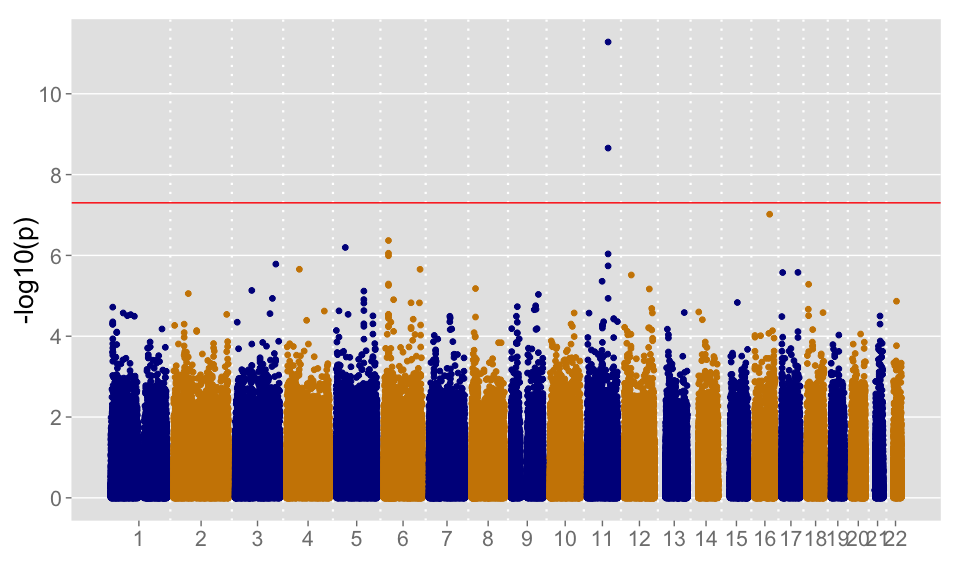
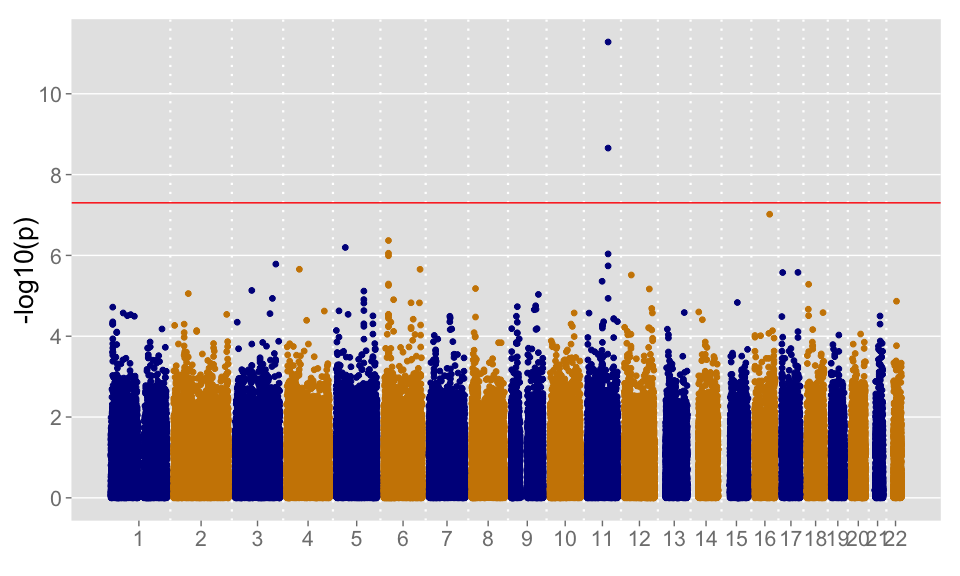

# R scripts for summarizing GWAS results

Plotting Manhattan plots and QQ plots are standard procedures for visualizing association analysis results from a genome-wide association study (GWAS). Making the plots can be time-consuming, especially when the number of genetic variants is as big as 20 million, since ggplot2 needs to put a dot for each variant. However, the majority of the variants are non-significant with a given p value threshold, for example p > 0.01, therefore they constitute the bulk of the plot yet they overlap with each, which is a waste of time. By randomly selecting a sub-sample from the variants, time can be saved, while the plot appears no different and carries the same information. When the number of SNPs is huge, the saving can be more than 10 folds.

Here is an example:


```r
source('./gwas_sum.R')
```

```
## 
## Attaching package: 'dplyr'
## 
## The following objects are masked from 'package:data.table':
## 
##     between, last
## 
## The following object is masked from 'package:stats':
## 
##     filter
## 
## The following objects are masked from 'package:base':
## 
##     intersect, setdiff, setequal, union
```

```r
results="gwas_dom_air.csv"
output_mh="air_mh.tiff"

library(data.table)
```

```r
gwas_result <- fread(results)
```

In this dataset we have 693117 SNPs.

#### 1. Normal plotting
Plotting all SNPs, the Manhattan plot and the time for plotting are

```r
mhplot(results = results,output_mh = output_mh,fast_plot = F,plot_to_console = T)
```

```
## Generating Manhattan plot ...
```

 

```
##  in 57.083  s
```

#### 2. Fast plotting
Using the trick mentioned earlier, the Manhattan plot and the time for plotting are

```r
mhplot(results = results,output_mh = output_mh,fast_plot = T,plot_to_console = T,
       p_cut = 1e-1,snp_frac = 0.2)
```

```
## Generating Manhattan plot ...
```

 

```
##  in 16.994  s
```
The arguments *p_cut* and *snp_frac* can be modified according to the number of SNPs and average p values.
